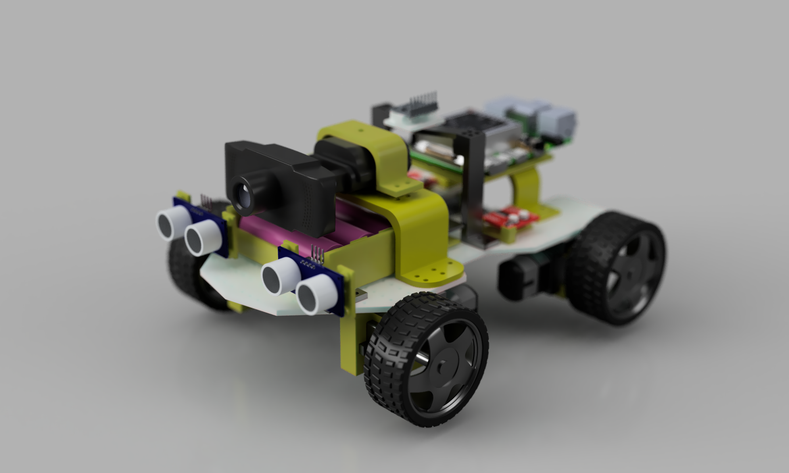
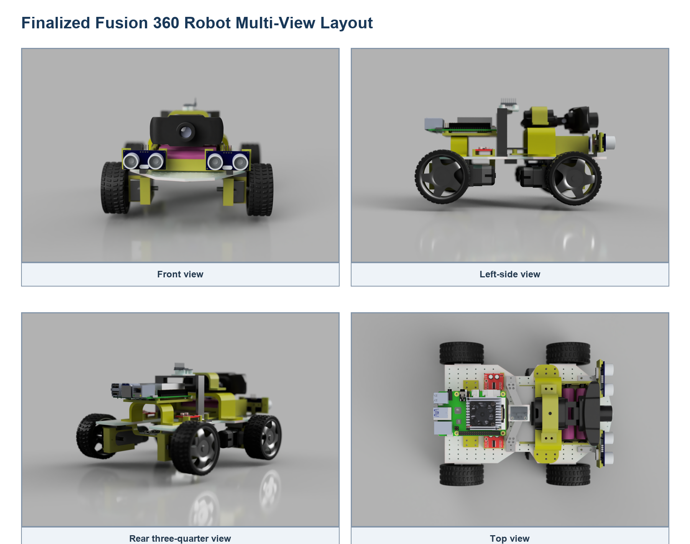
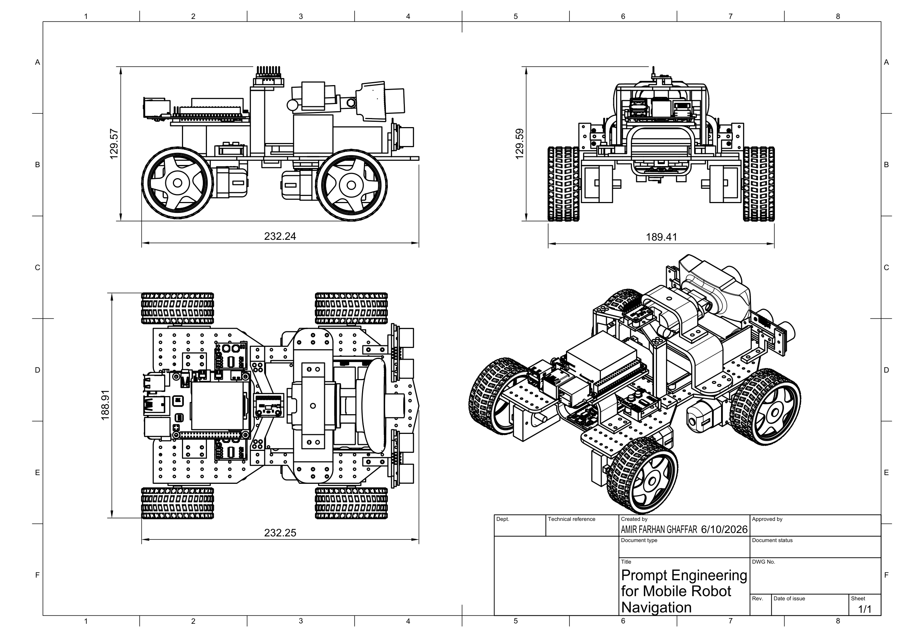

# CHAPTER 3

# RESEARCH METHODOLOGY

## 3.1 Introduction

This chapter presents the finalized methodology for `Prompt Engineering for
Mobile Robot Navigation`. The project contains one physical implementation: a
Raspberry Pi 4 mobile robot with an ESP32 sensor, safety, and motor-control
layer.

The methodology is inspired by the modular structure of LM-Nav and the
prompt-based action-selection idea of VLMnav. Language interpretation, visual
grounding, and navigation execution are separated so each stage can be tested.
The first prototype targets `find the green marker` and restricts all output
to:

- `move_forward`
- `turn_left`
- `turn_right`
- `search`
- `stop`

The laptop-only Docker demonstration is used only to produce expected-results
evidence before physical testing. It is not a second physical approach.

## 3.2 Research Design and Project Workflow

The project follows an iterative prototype methodology. The already-built
mechanical and power systems are completed by wiring and validating the ESP32
sensor and motor layer, connecting Raspberry Pi USB serial, verifying webcam
capture and OpenCV visual grounding, and testing one complete basic goal.

### 3.2.1 Methodology Alignment with Research Objectives

**Table 3.1: Methodology Alignment with Research Objectives**

| Research Objective | Method Used | Expected Output | Evaluation |
|---|---|---|---|
| Objective 1: Develop a structured prompt-engineering pipeline | Convert a simple instruction into fixed navigation fields and approved actions | Parseable target, action goal, and uncertainty | Prompt validity and target-extraction accuracy |
| Objective 2: Integrate one Raspberry Pi 4 physical robot | Connect Raspberry Pi, ESP32, webcam, sensors, MX1508 drivers, motors, and completed power system | Working end-to-end robot | Wiring, sensor, motor, USB serial, and power tests |
| Objective 3: Evaluate basic prompt-engineered navigation | Run repeated single-target indoor trials | Measured action, latency, safety, and movement results | Grounding correctness, action accuracy, safe-stop rate, and goal completion |

### 3.2.2 Overall Project Workflow

**Figure 3.1: Proposed project workflow**

```text
Define one basic goal, prompt schema, actions, and metrics
        |
        v
Complete Raspberry Pi, ESP32, sensor, and motor-driver wiring
        |
        v
Validate ESP32 sensors, safety, and four-motor control
        |
        v
Install Raspberry Pi OS and verify webcam and USB serial
        |
        v
Integrate prompt parser, OpenCV grounding, action selection, and logging
        |
        v
Run dry tests, raised-wheel tests, and controlled floor tests
        |
        v
Analyse failures and report measured results
```

### 3.2.3 Development Workflow

**Table 3.2: Development Workflow**

| Stage | Activity | Expected Output |
|---|---|---|
| Stage 1 | Finalize the basic goal, action set, prompt schema, scenarios, and logging format | Common experimental definition |
| Stage 2 | Verify the completed power system and common-ground architecture | Stable compute and motor supplies |
| Stage 3 | Wire ESP32 sensors and two MX1508 drivers, then connect Raspberry Pi USB devices | Completed signal wiring |
| Stage 4 | Test ESP32 sensing, motor directions, timeout, and obstacle stop | Verified local safety and movement |
| Stage 5 | Install Raspberry Pi OS and verify webcam and USB serial | Working Raspberry Pi platform |
| Stage 6 | Integrate structured prompt processing, OpenCV grounding, action selection, and logging | Working end-to-end prototype |
| Stage 7 | Run repeated controlled trials and calculate metrics | Final physical results |

## 3.3 Finalized System Architecture

The Raspberry Pi 4 performs high-level processing. The ESP32 handles local
real-time sensing, safety, and motor control. USB serial is used between the
boards because it is simple to debug and leaves all ESP32 motor GPIO pins
available.

**Figure 3.2: Proposed system architecture**

```text
User simple natural-language goal
        |
        v
Raspberry Pi 4
  - structured prompt processing
  - USB webcam capture
  - OpenCV visual grounding
  - restricted action selection and logging
        |
        | USB serial, 115200 baud
        v
ESP32
  - two HC-SR04 sensors
  - GY-291 / ADXL345
  - obstacle, sensor-fault, and command-timeout safety
  - two MX1508 motor drivers
        |
        v
Four DC gear motors with wheels
```

### 3.3.1 Hardware Roles

**Table 3.3: Finalized Hardware Roles**

| Component | Finalized Role |
|---|---|
| Raspberry Pi 4 | Onboard prompt processing, webcam capture, OpenCV grounding, action selection, and logging |
| ESP32 | USB serial communication, sensor reading, deterministic safety, and motor control |
| USB webcam | Front RGB image input |
| Two HC-SR04 sensors | Front-left and front-right obstacle safety |
| GY-291 / ADXL345 | Acceleration, roll/pitch tilt, motion, vibration, and shock observations |
| Two MX1508 drivers | Four independent DC motor channels |
| Four DC gear motors | Physical forward, turn, search, and stop behaviour |

## 3.4 Requirements, Constraints, and Acceptance Criteria

**Table 3.4: Requirements and Acceptance Criteria**

| Requirement | Specification | Verification Method | Pass Criteria |
|---|---|---|---|
| Natural-language input | Accept a supported goal such as `find the green marker` | Input test | Instruction is accepted without manual rewriting |
| Structured prompt output | Return fixed machine-readable fields | JSON validation | Required fields are present and parseable |
| Raspberry Pi onboard processing | Run prompt parser, webcam, grounding, action selection, and logging onboard | Integration test | Raspberry Pi completes the navigation loop |
| Webcam visual grounding | Detect a supported coloured marker | Camera scenario test | Correct grounding or safe search response |
| Raspberry Pi-to-ESP32 USB serial | Exchange commands and sensor JSON at 115200 baud | Serial test | Stable command and status communication |
| Four-motor control | Two MX1508 modules control four motors | Raised-wheel test | Forward, left, right, search, and stop work |
| Local safety | Obstacle, sensor fault, timeout, or invalid command stops movement | Failure-case test | Unsafe movement is prevented |
| Power stability | Completed power system supplies stable rails | Voltage and runtime test | No unsafe voltage, reset, or severe drop |

The baseline does not include SLAM, LiDAR mapping, dense depth, or an
unrestricted large vision-language model.

## 3.5 Data, Test Environment, and Experimental Materials

### 3.5.1 Basic Goal and Scenarios

**Table 3.5: First-Prototype Scenarios**

| Scenario | Example Instruction | Expected Behaviour |
|---|---|---|
| Supported target absent | "Find the green marker." | `search` |
| Target on left | "Find the green marker." | `turn_left` |
| Target on right | "Find the green marker." | `turn_right` |
| Target centred and distant | "Find the green marker." | `move_forward` |
| Target centred and close | "Find the green marker." | `stop` |
| Unsupported or ambiguous target | "Go there." | `stop` |
| Obstacle present | "Find the green marker." | ESP32 forces `stop` |

### 3.5.2 Experimental Materials

**Table 3.6: Experimental Materials**

| Material | Quantity or Role |
|---|---|
| Raspberry Pi 4 | Only onboard high-level compute board |
| ESP32 | Sensor, safety, USB serial, and motor-control controller |
| USB webcam | One front RGB camera |
| DC gear motor with wheel | Four motors and wheels |
| MX1508 dual motor-driver module | Two modules controlling four motors |
| Adjustable motor buck converter | Regulated motor-driver rail |
| HC-SR04 ultrasonic sensor | Two front obstacle sensors |
| GY-291 / ADXL345 accelerometer | Acceleration, roll/pitch tilt, motion, vibration, and shock sensing |
| Completed battery and power system | Mobile robot power source |
| Coloured marker | Repeatable first visual landmark |
| Instruction and scenario list | Common experimental inputs |
| JSONL result logs | Store prompts, detections, sensors, actions, latency, and failures |

**Figure 3.3: Main hardware components for the finalized Raspberry Pi 4 robot**

```text
Raspberry Pi 4
ESP32
USB webcam
Two HC-SR04 ultrasonic sensors
GY-291 / ADXL345
Two MX1508 motor drivers
Four DC gear motors with wheels
Completed protected power system
```

### 3.5.3 Software and Model Requirements

**Table 3.7: Software, Model, and Platform Requirements**

| Item | Purpose | Finalized Tool or Example |
|---|---|---|
| Raspberry Pi operating system | Run the onboard application | Raspberry Pi OS Lite 64-bit |
| High-level language | Prompt parser, grounding, validation, serial, and logging | Python |
| Webcam processing | Capture and process RGB frames | OpenCV |
| Prompt processing | Produce structured basic-goal output | Deterministic fixed-schema parser |
| Initial visual grounding | Detect supported coloured marker | OpenCV HSV segmentation |
| ESP32 firmware | Sensors, safety, USB serial, and two-MX1508 motor control | Arduino framework |
| Communication | Raspberry Pi to ESP32 commands and status | USB serial at 115200 baud |
| Result storage | Record experimental data | JSONL |
| Future grounding | Detect indoor objects and landmarks | OpenCV DNN, TensorFlow Lite, or API-based VLM |

## 3.6 Prompt Engineering Design

The first prototype uses a deterministic structured parser. This applies the
main prompt-engineering principles required by the study: fixed fields,
restricted actions, explicit uncertainty, and safe rejection of unsupported
goals.

**Table 3.8: Structured Prompt Fields**

| Field | Description | First-Prototype Example |
|---|---|---|
| `instruction` | Original user instruction | `find the green marker` |
| `target` | Main supported target | `green marker` |
| `landmarks` | Important instruction objects | `["green marker"]` |
| `spatial_relation` | Relation if supported | `null` |
| `action_goal` | Short interpreted goal | `find and approach the green marker` |
| `uncertainty` | Safety-oriented confidence label | `low` or `high` |

```json
{
  "instruction": "find the green marker",
  "target": "green marker",
  "landmarks": ["green marker"],
  "spatial_relation": null,
  "action_goal": "find and approach the green marker",
  "uncertainty": "low"
}
```

Unsupported or unclear instructions produce high uncertainty and `stop`.

## 3.7 Webcam-Based Visual Grounding and Action Selection

The Raspberry Pi captures a USB-webcam frame and detects the selected marker
using OpenCV HSV colour segmentation. The largest valid marker region is used
for simple action selection.

**Table 3.9: Visual Grounding and Action Decision Rules**

| Condition | Selected Action |
|---|---|
| Structured target unsupported or uncertain | `stop` |
| Marker not detected | `search` |
| Marker centre is left of the image centre zone | `turn_left` |
| Marker centre is right of the image centre zone | `turn_right` |
| Marker is centred and below the goal-size threshold | `move_forward` |
| Marker reaches the configured image-area threshold | `stop` |
| ESP32 reports obstacle or sensor fault | `stop` |

After this baseline works, the OpenCV grounding module can be replaced with a
lightweight detector for chairs, doors, signboards, or other indoor landmarks.

## 3.8 Robot Action and Command Mapping

**Table 3.10: Action Set and Motor Command Mapping**

| Action | ESP32 Command | Four-Motor Behaviour |
|---|---|---|
| `move_forward` | `FWD` | All motors move forward |
| `turn_left` | `LEFT` | Left motors reverse and right motors move forward |
| `turn_right` | `RIGHT` | Right motors reverse and left motors move forward |
| `search` | `SEARCH` | Robot rotates slowly |
| `stop` | `STOP` | All motor outputs stop |

The ESP32 accepts only these commands. Unknown commands, loss of both
ultrasonic readings, and a command delay above 1,000 ms cause `stop`.

## 3.9 Mechanical Design and Physical Integration

The finalized Fusion 360 robot design provides mounting positions for the
Raspberry Pi 4, ESP32, USB webcam, two front ultrasonic sensors, GY-291, two
MX1508 drivers, completed power system, and four motors.

**Figure 3.4: Finalized Fusion 360 physical robot model**



The existing render records the physical design and Raspberry Pi mounting
layout.

**Figure 3.5: Finalized Fusion 360 robot multi-view layout**



The views support sensor visibility, wheel clearance, component spacing, cable
access, and Raspberry Pi mounting verification.

**Figure 3.6: Finalized mechanical design sketch and dimensions**



The approximate overall dimensions are 232.24 mm long, 188.91 mm wide, and
129.57 mm high.

## 3.10 Finalized Wiring Architecture

**Figure 3.7: Finalized component-based circuit architecture**

```text
Completed protected power system
        |
        +--> regulated motor rail --> two MX1508 drivers --> four motors
        |
        +--> regulated logic rail --> Raspberry Pi 4
                                      +--> USB power and serial --> ESP32

Raspberry Pi USB port --> USB webcam
Raspberry Pi USB port --> ESP32 USB power and serial
ESP32 --> sensors and MX1508 control inputs
```

**Figure 3.8: Finalized ESP32 sensor and motor wiring**

```text
Raspberry Pi USB port <-> ESP32 USB data + power cable

HC-SR04 front-left: Trigger GPIO 5, Echo GPIO 34 through level shifting
HC-SR04 front-right: Trigger GPIO 18, Echo GPIO 35 through level shifting
GY-291 I2C: SDA GPIO 21, SCL GPIO 22
Front-left motor: GPIO 25 and GPIO 26
Front-right motor: GPIO 27 and GPIO 14
Rear-left motor: GPIO 32 and GPIO 33
Rear-right motor: GPIO 16 and GPIO 17
```

The detailed connection and test sequence is provided in
`docs/circuit_wiring_guide.md`.

## 3.11 Software Implementation

**Table 3.11: Source Code and Documentation Modules**

| File or Module | Target | Purpose | Status |
|---|---|---|---|
| `docs/raspberry_pi_4_full_software_setup.md` | Documentation | Raspberry Pi OS-to-final-result setup | Provided |
| `docs/circuit_wiring_guide.md` | Documentation | Exact Raspberry Pi, ESP32, sensor, and MX1508 wiring | Provided |
| `docs/laptop_only_expected_results_setup.md` | Documentation | Separate Docker-based FYP1 expected-results demonstration | Provided |
| `src/raspberry_pi_robot/robot_controller.py` | Raspberry Pi 4 | Prompt parser, OpenCV grounding, action selection, USB serial, and logging | Provided |
| `src/laptop_expected_results/web_app.py` | Docker laptop demo | Browser-webcam frame processing and expected action output | Provided |
| `firmware/esp32_robot_controller/esp32_robot_controller.ino` | ESP32 | USB serial, sensors, safety, and four-motor control | Provided |

## 3.12 Main Equations and Decision Rules

**Table 3.12: Main Equations and Decision Rules**

| Equation or Rule | Description | Evaluation Use |
|---|---|---|
| `d_cm = t_echo_us / 58` | HC-SR04 distance approximation | Convert Echo duration to centimetres |
| `Prompt Validity = N_valid / N_total * 100 percent` | Valid structured-output percentage | Prompt reliability |
| `Accuracy = N_correct / N_total * 100 percent` | General correctness percentage | Grounding and action metrics |
| `T_total = T_prompt + T_capture + T_grounding + T_sensor + T_comm` | End-to-end response time | Raspberry Pi latency |
| `a_exec = stop` for invalid output, high uncertainty, obstacle, sensor fault, timeout, or invalid action | Safety decision rule | Safe-failure evaluation |
| `Movement Success Rate = N_success / N_scenarios * 100 percent` | Successful simple-goal percentage | Physical robot behaviour |
| `a_mag = sqrt(a_x^2 + a_y^2 + a_z^2)` | Total measured acceleration magnitude | Motion, vibration, and shock observation |

## 3.13 Implementation Procedure

**Table 3.13: Implementation Procedure**

| Stage | Activity | Verification | Expected Result |
|---|---|---|---|
| Stage 1 | Verify completed power rails and common ground | Multimeter and load test | Stable compute and motor supplies |
| Stage 2 | Wire ESP32, sensors, and both MX1508 drivers | Continuity and pin-map review | Correct signal wiring |
| Stage 3 | Flash ESP32 and connect it to Raspberry Pi by USB | `PING` and sensor-status test | Stable commands and JSON status |
| Stage 4 | Test four motors with wheels raised | Individual and combined action tests | Correct movement directions |
| Stage 5 | Install Raspberry Pi OS and test webcam | Camera capture test | Working Raspberry Pi platform |
| Stage 6 | Run Raspberry Pi controller without `--execute` | Dry-run logs | Correct prompt, grounding, action, and STOP command |
| Stage 7 | Enable supervised raised-wheel movement | End-to-end command test | Correct action-to-motor behaviour |
| Stage 8 | Run controlled floor scenarios | Scenario checklist and logs | Measured basic-goal results |

## 3.14 Testing and Validation Plan

**Table 3.14: Testing and Validation Matrix**

| Test Stage | Test Setup | Metric | Pass Criteria |
|---|---|---|---|
| Prompt format test | Supported and unsupported instructions | Prompt output validity | Required fields parse correctly |
| Webcam test | USB webcam on Raspberry Pi | Frame capture success | Reliable usable frames |
| Grounding test | Supported marker in controlled views | Grounding correctness | Correct match or safe search |
| USB serial test | Raspberry Pi and ESP32 | Command/status reliability | Repeated valid exchanges |
| Ultrasonic test | Two front sensors | Distance availability and error | Both sensors report usable values |
| GY-291 test | Stationary, tilted, moved, and lightly vibrated robot | Plausibility and response | Expected changes are observable |
| Motor test | Two MX1508 modules and four motors | Movement correctness | All approved actions work |
| Safety test | Obstacle, sensor fault, timeout, invalid command, and uncertainty | Safe-stop rate | Robot stops safely |
| Full scenario test | Controlled green marker | Goal completion | Intended basic behaviour is completed |

## 3.15 Evaluation Metrics

**Table 3.15: Evaluation Metrics**

| Metric | Description |
|---|---|
| Prompt output validity | Percentage of outputs containing all required fields |
| Supported-target extraction accuracy | Percentage of correctly extracted supported targets |
| Visual grounding correctness | Percentage of correctly grounded marker conditions |
| Action-selection accuracy | Percentage of expected selected actions |
| End-to-end latency | Time from instruction and frame input to validated action |
| USB serial reliability | Percentage of valid command and sensor-status exchanges |
| Safe-stop rate | Percentage of unsafe cases correctly stopped |
| Movement success rate | Percentage of completed simple-goal scenarios |
| GY-291 response | Plausibility of acceleration, tilt, motion, and vibration observations |
| Power stability | Resets, voltage drops, or failures during testing |

## 3.16 Laptop-Only Docker Expected-Results Demonstration

The separate laptop demo uses a browser webcam and coloured marker to display
expected navigation actions. A Docker container provides the isolated Flask,
OpenCV, NumPy, and logging environment. The user manually moves the laptop; no
motor interface or physical robot claim is made. Final results must come from
the Raspberry Pi 4 physical robot.

## 3.17 Safety, Limitations, and Future Work

Testing must use the completed protected power system, fuse, reachable main
switch, correct regulated rails, and a common ground. Motor tests begin with
the robot raised. HC-SR04 Echo pins require level shifting.

During the first prototype, the ESP32 is powered only by the Raspberry Pi USB
cable. A separate ESP32 5 V supply must not be connected simultaneously unless
the USB 5 V conductor is safely isolated.

The robot stops for invalid output, high uncertainty, obstacle detection,
sensor fault, unknown commands, or command timeout. Testing is supervised in a
controlled indoor area.

The USB webcam does not provide dense depth or a 3D map. Two ultrasonic sensors
provide limited obstacle coverage. The GY-291 does not provide yaw heading.
The Raspberry Pi 4 has limited performance for large models, and the first
prototype supports only simple coloured-marker goals.

Future work may include lightweight object detection, API-based VLM
experiments, wheel encoders, magnetometer or full IMU, RGB-D camera, LiDAR,
mapping, relation-aware prompts, and stronger navigation policies.

## 3.18 Summary

This chapter finalized the methodology around one Raspberry Pi 4 physical
robot. The project connects structured prompt processing and OpenCV visual
grounding to an ESP32 that independently handles sensors, safety, and
four-motor control. The first measurable target is a reliable and safe
single-goal indoor marker-navigation demonstration.
