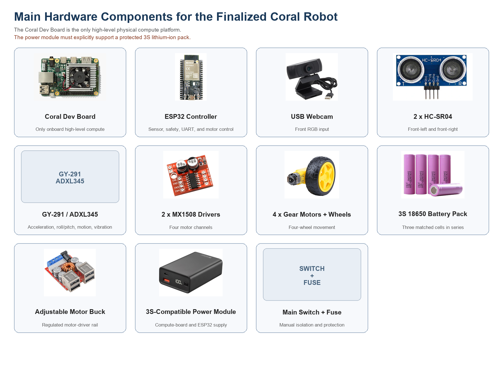

<p align="center">
  
</p>

# Prompt Engineering for Mobile Robot Navigation

<p align="center">
  A low-cost Raspberry Pi 4 and ESP32 mobile robot that converts a simple
  natural-language goal into restricted, safety-checked movement actions.
</p>

<p align="center">
  
  
  
  
  
</p>

## Prototype Model

<p align="center">
  
</p>

The finalized prototype uses a Raspberry Pi 4 for high-level processing and an
ESP32 for deterministic sensor, safety, and motor control. Its four-wheel
chassis carries a front USB webcam, two front ultrasonic sensors, a
GY-291/ADXL345 accelerometer, two MX1508 motor drivers, and a protected power
system.

<p align="center">
  
</p>

## What It Does

The project studies a practical language-to-vision-to-action pipeline:

```text
Natural-language goal
        |
        v
Structured prompt output
        |
        v
Webcam visual grounding
        |
        v
Restricted action selection
        |
        v
ESP32 safety validation and motor control
```

The approved action set is deliberately small:

```text
move_forward | turn_left | turn_right | search | stop
```

The ESP32 can independently force `STOP` when it detects an obstacle, sensor
fault, invalid command, or command timeout.

## Current Results

### Docker Door-Navigation Demonstration

The working Docker laptop demonstration accepts:

```text
find the door
```

It converts the instruction into a structured goal and uses an OpenCV
colour-and-shape detector tuned to the project's grey-blue corridor doors. The
browser captures the webcam while the container processes each frame and
displays the selected action.

<p align="center">
  
</p>

Observed screenshot evidence currently demonstrates:

| Observed condition | Displayed action |
|---|---|
| No valid door region detected | `SEARCH` |
| Door detected on the right side | `TURN RIGHT` |
| Door occupies the configured goal-size area | `STOP` |

The Docker demo is a high-level software demonstration. The laptop is moved
manually and no physical motor command is executed.

### Physical Robot Baseline

The first Raspberry Pi physical baseline uses a coloured marker as a
repeatable visual landmark while the Raspberry Pi-to-ESP32 wiring and physical
movement tests are completed.

```text
find the green marker
```

This simpler baseline allows camera processing, USB serial communication,
ultrasonic safety, motor directions, latency, and movement success to be
measured before transferring the door detector or a stronger vision model to
the physical robot.

## System Architecture

```text
User instruction
      |
      v
Raspberry Pi 4
  - fixed-schema prompt parser
  - USB webcam capture
  - OpenCV visual grounding
  - action selection and JSONL logging
      |
      | USB serial at 115200 baud
      v
ESP32
  - 2 x HC-SR04 obstacle sensors
  - GY-291 / ADXL345 observations
  - obstacle, sensor-fault, and timeout safety
  - 2 x MX1508 motor drivers
      |
      v
4 x DC gear motors
```

<p align="center">
  
</p>

## Project Status

| Area | Status |
|---|---|
| Fusion 360 robot design and printable mounts | Complete |
| Mechanical chassis and protected power system | Built |
| Docker `find the door` visual demonstration | Working |
| Raspberry Pi controller and ESP32 firmware | Implemented |
| Raspberry Pi, ESP32, sensor, and motor-driver signal wiring | In progress |
| Raised-wheel and controlled-floor movement validation | Pending |
| Final physical navigation measurements | Planned for FYP2 |

This repository is an active research prototype. The Docker screenshots are
real software results, but final robot-navigation claims require repeated
physical testing.

## Quick Start: Docker Demo

Requirements:

- Docker Desktop using Linux containers
- A browser with webcam permission
- Local port `8000`

Run from the repository root:

```powershell
docker compose -f docker-compose.laptop-demo.yml up --build
```

Open <http://localhost:8000>, select **Start Camera**, and enter
`find the door`.

Stop the demo:

```powershell
docker compose -f docker-compose.laptop-demo.yml down
```

Full instructions: [Docker Laptop Demonstration Setup](docs/laptop_only_expected_results_setup.md)

## Physical Robot Setup

1. Complete the signal wiring using the
   [Raspberry Pi, ESP32, and MX1508 Wiring Guide](docs/circuit_wiring_guide.md).
2. Flash
   [`firmware/esp32_robot_controller/esp32_robot_controller.ino`](firmware/esp32_robot_controller/esp32_robot_controller.ino).
3. Install Raspberry Pi OS and dependencies using the
   [Raspberry Pi 4 Full Software Setup](docs/raspberry_pi_4_full_software_setup.md).
4. Run the Raspberry Pi controller without `--execute` for the first dry test.
5. Enable movement only during supervised raised-wheel testing.

Example dry run:

```bash
python3 src/raspberry_pi_robot/robot_controller.py \
  --instruction "find the green marker" \
  --camera 0 \
  --serial-device /dev/ttyUSB0
```

The controller always sends `STOP` unless the `--execute` flag is explicitly
provided.

## Safety

- Never power motors from Raspberry Pi or ESP32 logic pins.
- Level-shift both 5 V HC-SR04 Echo signals before ESP32 GPIO.
- Keep a common ground between the ESP32, sensors, motor drivers, and power
  system.
- For the first prototype, power the ESP32 only through the Raspberry Pi USB
  cable.
- Begin all motor tests with the wheels raised and the main switch reachable.
- The GY-291/ADXL345 provides acceleration and roll/pitch observations; it does
  not provide yaw heading.

## Repository Guide

| Path | Purpose |
|---|---|
| [`src/raspberry_pi_robot/`](src/raspberry_pi_robot/) | Raspberry Pi prompt, camera, action, serial, and logging controller |
| [`firmware/esp32_robot_controller/`](firmware/esp32_robot_controller/) | ESP32 sensor, safety, USB serial, and four-motor firmware |
| [`src/laptop_expected_results/`](src/laptop_expected_results/) | Docker browser-webcam door-navigation demonstration |
| [`Expected_result_simulation/`](Expected_result_simulation/) | Captured Docker result screenshots |
| [`docs/`](docs/) | Wiring, software setup, and research method guides |
| [`STL/`](STL/) | Printable robot mounting components |
| [`figures/`](figures/) | Prototype, hardware, and report figures |
| [`github-research-papers/`](github-research-papers/) | Related research implementations used for method study |

## Research and Documentation

The project is inspired by modular language-guided navigation methods such as
LM-Nav and prompt-based action selection such as VLMnav. Advanced mapping,
scene graphs, learned navigation policies, and large VLM/VLA models are studied
as future extensions rather than claimed as current baseline capabilities.

- [Research-Paper Method Selection](docs/research_paper_method_selection.md)
- [Chapter 1: Introduction](chapter_1_introduction.md)
- [Chapter 2: Literature Review](literature_review.md)
- [Chapter 3: Methodology](chapter_3_methodology.md)
- [Latest Chapter 4 Results DOCX](chapter_4_results_and_discussion.docx)

## Limitations

- The current Docker door detector is tuned to grey-blue doors in one corridor
  and is not a general semantic door-recognition model.
- Door stopping uses apparent image area, not measured physical distance.
- The first physical baseline uses coloured-marker grounding.
- Two ultrasonic sensors provide limited obstacle coverage.
- Physical robot results and complete action validation are still pending.

## Author

**Amir Farhan Bin Ghaffar**<br>
Final Year Project, Department of Mechatronics Engineering<br>
International Islamic University Malaysia
